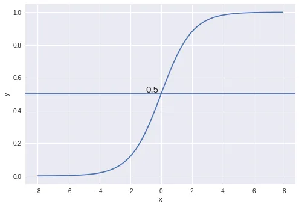

# Logistic Regression

Logistic Regression is generally used for classification purposes (categorical output). Unlike Linear Regression, the dependent variable can take a limited number of values only i.e, the dependent variable is categorical. When the number of possible outcomes is only two it is called Binary Logistic Regression.

The outputs of a linear regression are passed through an activation function (typically sigmoid), which maps the value to either 0 or 1. If the probability is greater than 0.5, we classify it as Class-1(Y=1) or else as Class-0(Y=0).

Logistic regression still falls under the broader umbrella of regression analysis because it tries to estimate the probability of an event happening, and probabilities can be interpreted as continuous values.

The cost function for logistic regression can be a piecewise function based on if y is 0 or 1. If the actual class is 1 and the model predicts 0, we should highly penalize it and vice-versa.

As you can see from the below picture, for the plot -log(h(x)) as h(x) approaches 1, the cost is 0 and as h(x) nears 0, the cost is infinity(that is we penalize the model heavily). Similarly for the plot -log(1-h(x)) when the actual value is 0 and the model predicts 0, the cost is 0 and the cost becomes infinity as h(x) approaches 1.

The equations can be combined, the average taken, and then the minimum found with gradient descent.

## Assumptions
**1). Linearity of Log-Odds:** Logistic regression assumes a linear relationship between the log-odds of the dependent variable and the independent variables. This assumption is crucial for the model to be effective.

**2). Independence of Errors:** The observations in logistic regression should be independent of each other. This assumption is similar to that in linear regression.

**3). Absence of Multicollinearity:** Logistic regression assumes that independent variables are not highly correlated with each other. High multicollinearity can lead to unstable coefficient estimates.